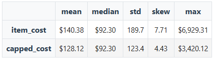
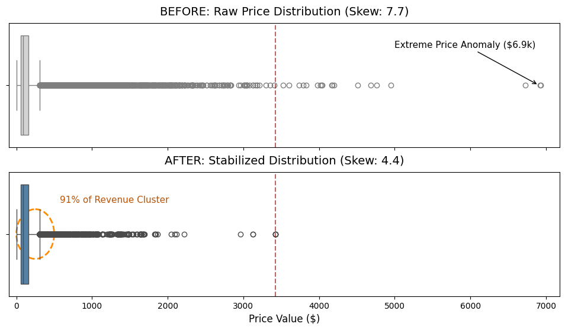

# Olist-Data-Stabilization-Audit
**Technical Objective:** Neutralizing a Global Price Skew of 7.7 in the Olist dataset to stabilize revenue forecasting.

# Summary
In the raw Olist e-commerce dataset, extreme price anomalies created a Global Price Skew of 7.7, rendering standard metrics like Average Order Value (AOV) and revenue forecasts unreliable.

This technical snippet demonstrates a Category-Specific Stabilization Pipeline designed to neutralize statistical noise while preserving 91% of organic high-value transaction volume. By applying localized 3xIQR caps, I successfully reduced the global skew to 4.4 and compressed data variance by 35%.

   
  <i>Audit showing comparison between raw and cleaned data</i>

### Technical Highlights
- **SQL Architecture:** Engineered 4-table relational joins in BigQuery to map transaction costs to product metadata, ensuring a granular "Item-level" grain for analysis.

- **Split-Stream Processing:** Developed a custom Python engine that separates categorized and uncategorized entries into independent stabilization streams before recombination.

- **Statistical Winsorization:** Applied 3xIQR thresholds at the category level to identify and cap "Ultra-Outliers" (reaching 77x the median) without deleting valuable business data.

- **Visual Auditing:** Created comparative distribution overlays (Boxplots) and automated exception reports to validate stabilization impact.

  

# How to View
View the [fully rendered report](https://nbviewer.org/github/jessicak222/Olist-Data-Stabilization-Audit-/blob/main/Olist_Stabilization_Audit.ipynb) on NBViewer.
